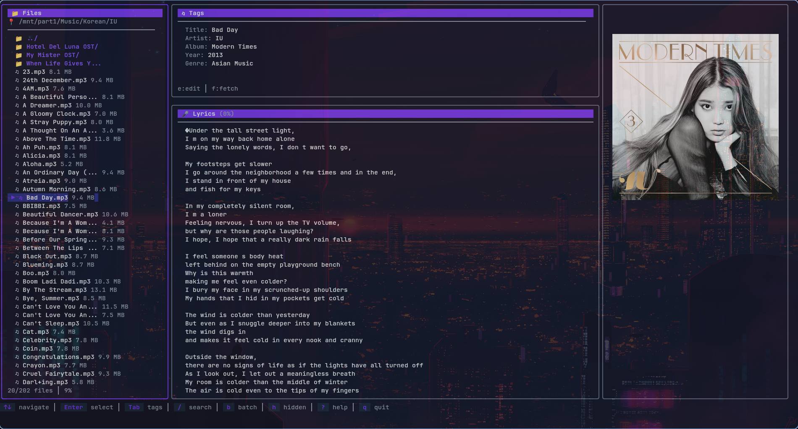
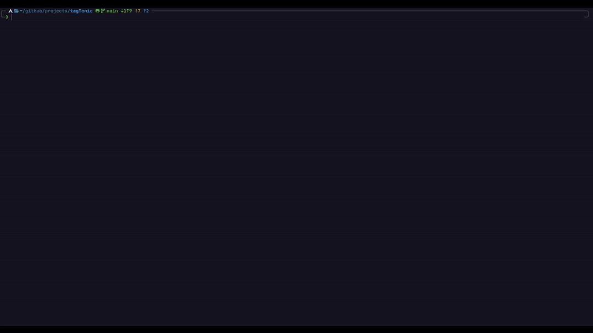

<div align="center">

# tagTonic

Edit tags, pull lyrics and album art right from your terminal. Supports image rendering in terminal using Kitty Protocol ₍^. .^₎⟆ 

[Article on dev.to](https://dev.to/capable_average/tagtonic-automating-10-years-of-messy-mp3-metadata-using-go-4b3j)



[](https://go.dev/)
[](LICENSE)

</div>

---

## Core Features

**Modern TUI** – Bubble Tea + Kitty protocol artwork rendering  
**Batch Processing** – Fast batch processing using goroutines  
**Smart Fetching** – Auto-grab lyrics & artwork using mp3 metadata

---

## Get Started

**Requirements:** Go 1.21+

#### Clone

```bash
# Clone and build
git clone https://github.com/sk-pathak/tagTonic.git
cd tagTonic
```
#### 1. Build with make

```
make build 
```

#### 2. Build without make
```
mkdir build
go build -o tagTonic
```

#### Run tagTonic

```
# Launch tui
./build/tagTonic tui
```



---

## Some Quick Fire Commands

```bash
# Fire up the TUI
tagTonic tui

# Edit tags inline
tagTonic edit song.mp3 --title "Song Title" --artist "Artist" --album "Album"

# Auto-fetch metadata
tagTonic fetch song.mp3 --lyrics --artwork

# Batch process entire library
tagTonic batch --dir ./music --recursive --lyrics --artwork
```

---

## Commands Cheat Sheet

| Command | Action | Key Flags |
|---------|--------------|-----------|
| `tui` | Launch the interactive UI | – |
| `edit` | Manually set tags | `--title` `--artist` `--album` `--genre` `--year` `--lyrics` `--artwork` |
| `fetch` | Auto-fetch from APIs | `--lyrics` `--artwork` `--force` |
| `batch` | Process multiple files | `--dir` `--recursive` `--pattern` `--lyrics` `--artwork` `--force` |
| `show` | Display current metadata | – |

Full docs → [USAGE.md](docs/USAGE.md)

---

## Development

```bash
make build    # Compile
make run      # Build + launch TUI
make lint     # Code quality checks
```

---

<div align="center">

## License

MIT © [sk-pathak](https://github.com/sk-pathak)
</div>