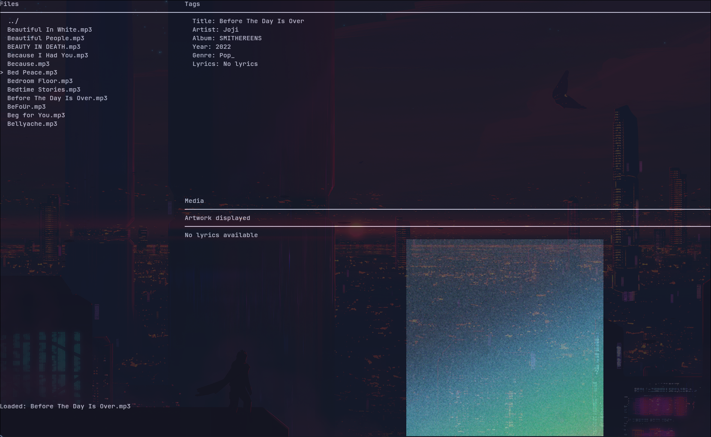
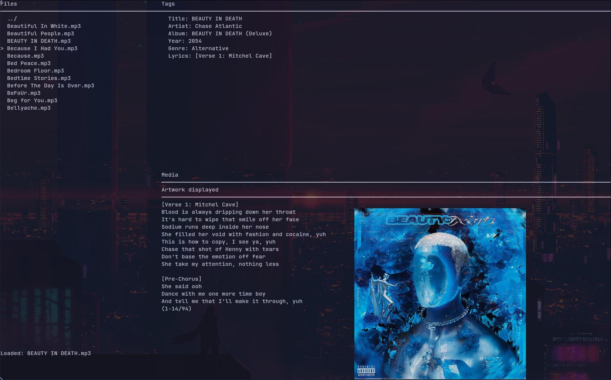

<div align="center">

# tagTonic

Lightweight MP3 tag editor & fetcher with a fast CLI and polished terminal UI (Go + Cobra + Bubble Tea) with image rendering support using kitty protocol ₍^. .^₎⟆

</div>

## Key Features

- Edit core tags: title, artist, album, genre, year, lyrics, artwork
- Fetch lyrics & artwork from multiple online sources
- Batch operations over directories (recursive + pattern match)
- Integrated TUI (navigation, preview, editing) or pure CLI usage
- Artwork & lyrics preview / replace

## Install

```bash
git clone https://github.com/sumit_pathak/tagTonic.git
cd tagTonic
go mod tidy
go build -o tagTonic
./tagTonic tui   # launch UI
```
Requires: Go 1.21+

## Quick Usage

```bash
# Launch TUI
tagTonic tui

# Edit tags
tagTonic edit song.mp3 --title "Title" --artist "Artist" --album "Album"

# Fetch lyrics & artwork
tagTonic fetch song.mp3 --lyrics --artwork

# Batch process a directory
tagTonic batch --dir ./music --lyrics --artwork --recursive
```

## Pics




## Primary Commands

| Command | Purpose | Common Flags |
|---------|---------|--------------|
| `tui`   | Launch interactive interface | – |
| `edit`  | Set or replace tags | `--title --artist --album --genre --year --lyrics --artwork` |
| `fetch` | Pull lyrics/artwork from APIs | `--lyrics --artwork --force` |
| `batch` | Apply fetch/edit over many files | `--dir --pattern --lyrics --artwork --recursive` |
